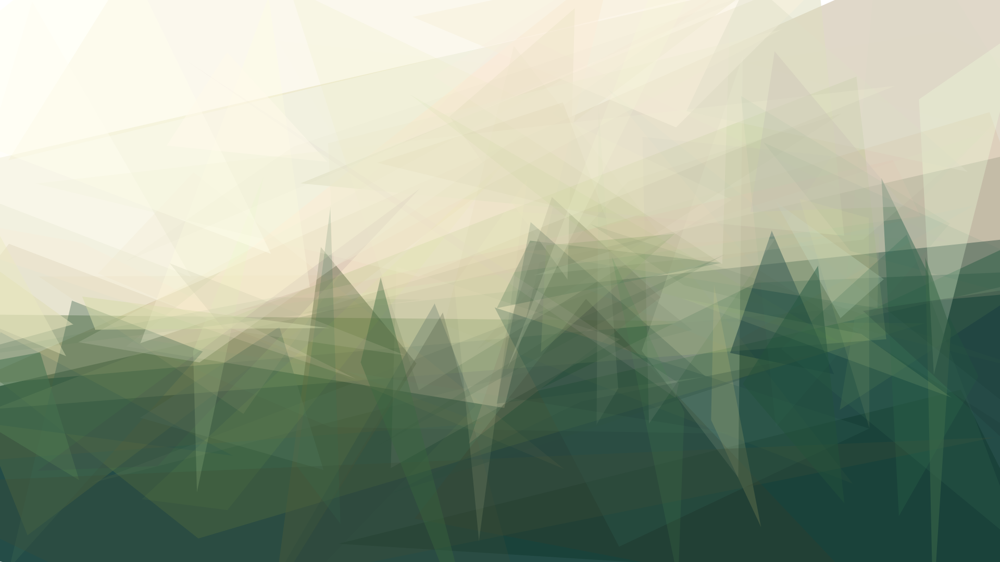
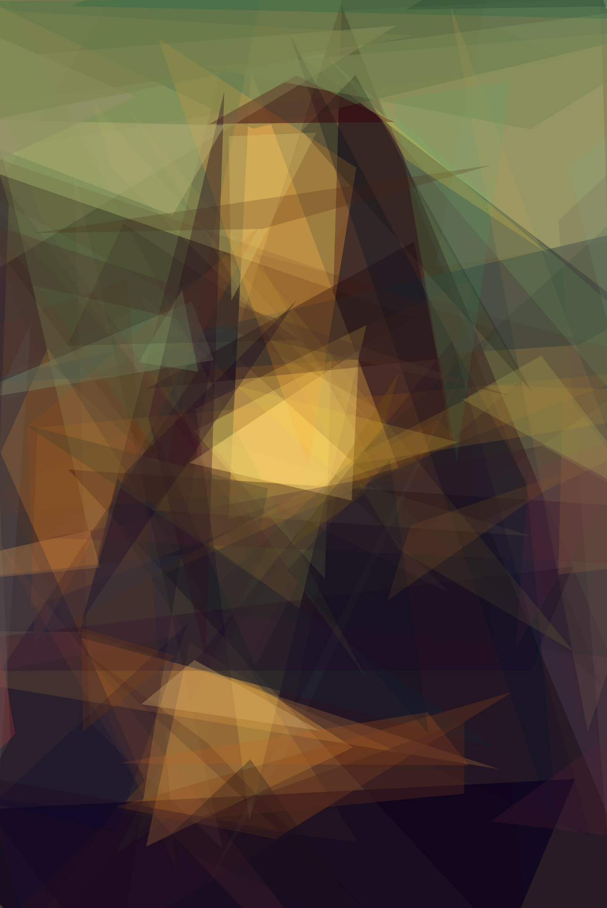
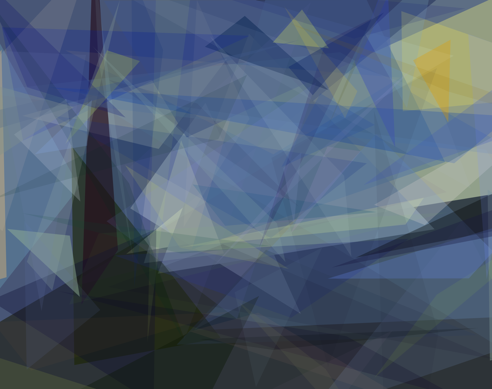
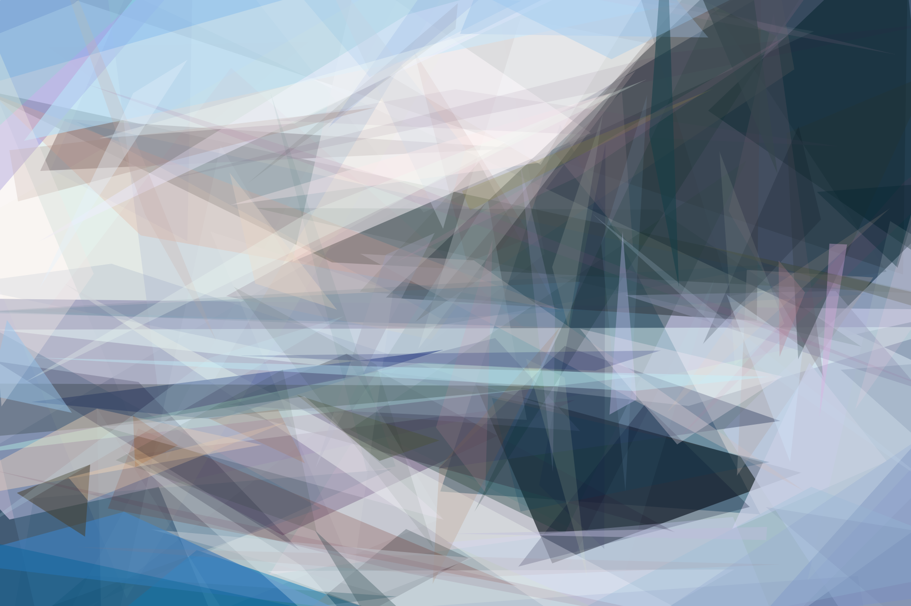

# Image Approximation with Triangles

## Overview

This program attempts to convert an image to be represented by a set of triangles as closely as possible. The algorithm isn't particularly fast, taking around 10 minutes for 100 triangles, nor is it that accurate. Most of the time, the result will look like a blurred version of the original image. However, if I do say so myself, the output usually makes a really nice wallpaper.

## Setup

The algorithm was written in GLSL and TypeScript, so upon cloning, download the dependencies:

```bash
npm install
```

To create and run a production build:

```bash
npm run build
npm start
```

The program will be running on http://localhost:3000.

You'll see an option to choose a file, and it should start running immediately upon selection. Note that WebGL has questionable support across many devices or browsers, so it is very possible nothing will happen.

## Results

<p float="left">
    
    
</p>
<p float="left">
    
    
</p>
